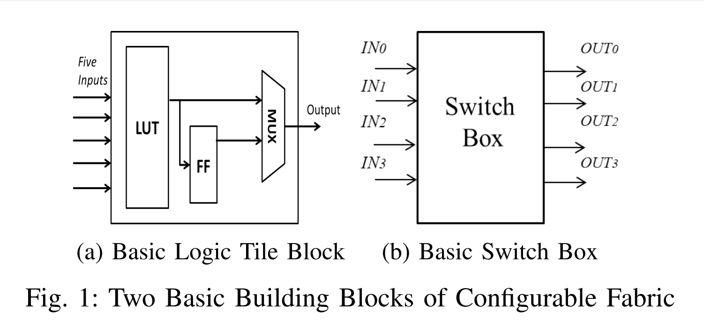
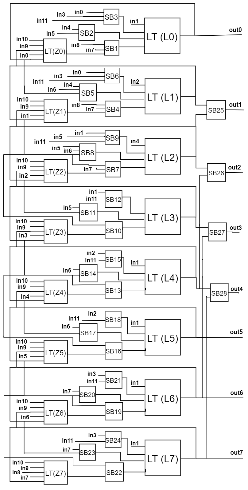

# Configurable Fabric

### FABRIC BUILDING BLOCKS

#### A. Logic Tiles

Logic tile (LT) is used as a lookup table, which is one hot encoded for different inputs. The logic tiles which is to be used to make the fabric must have five inputs and a single output that could be configured either in synchronous or combinational mode.

The basic block level structure of the logic tile is shown in Fig. 1a with five inputs and a single output. The output could be latched or non latched, for which purpose we have a single Flip Flop in it. A MUX is used to select between the latched or on-latched outputs. For such a Logic tile block, we need 32 bits for the LUT and 1 bit or MUX control in its Configuration file.

#### B. Switch Box

The switch box(SB) is designed to have 4 INPUT and 4 OUTPUTS. A block representation of SB is shown in fig. 1b. It is possible to connect any input wire to any output wire in SB. So in this particular 4x4 SB, for each input, can have a maximum fan-out of 4. The SB could be implemented using four multiplexers, one multiplexer for each output. Sixteen bits in the configuration file are required to implement such a single SB.

## Design

Centered text
**Fig. 2: FPGA Fabric for 4-bit adder, 8:3 encoder and 8-bit Universal Shift Register**

The circuit in Fig. 2 represents an FPGA fabric to perform the functionalities of either a 4-bit adder, an 8:3 encoder, or an 8-bit Universal Shift Register. The FPGA is built using 5-input logic tiles($LTs$) and 4x4 switch boxes($SBs$). The design consists of eight primarily logic tiles($L0-L7$), responsible for implementing the main functions governing the three test designs; eight secondary logic tiles($Z0-Z7$), accountable for carrying out secondary calculations; and 28 switch boxes($SB1-SB28$), functioning as one-hot encoded MUXs. At every logic tile input or every FPGA output port, there can be three choices at maximum(since there are three different circuits). $SBs$ select the required signals.

The circuit has 14 input ports($in0-in11$, $clock$ and $reset$) and eight output ports($out0-out7$), decided by the universal shift register circuit with the highest number of input-output ports. The configuration files are generated based on the equations to be implemented. In equations with more than five variables, multiple 5-input logic tiles are collectively used to obtain the result. For a circuit, a uniform configuration is maintained for all the switch boxes, which differs from the configuration maintained for the other circuits.

#### 4-bit adder:

$in3, in2, in1,$ and $in0$ represent the four bits of the first number, while $in7, in6, in5,$ and $in4$ hold the four bits of the second number. $in8$ contains the initial carry. For the pairwise addition of corresponding bits, logic tiles $L6, L4, L2$, and $L0$ calculate the resultant values of sum, while the logic tiles $L7, L5, L3,$ and $L1$ account for the corresponding carry values. The final carry is provided at $out4$ port, while the resultant four bits of the sum are provided through $out3, out2, out1$, and $out0$ ports.

#### 8:3 Encoder:

$in7-in0$ represents the eight inputs to the encoder. These eight inputs are encoded into three bits by the logic tiles $L2, L1,$ and $L0$. The three-bit output is obtained through $out2, out1,$ and $out0$ ports.

#### 8-bit Universal Shift Register:

Logic tiles $L7-L0$ are latched to behave as flip flops. $in7-in0$ stores the parallel inputs to all the flip flops. $in8$ contains the serial-input provided to the most-significant flip-flop. $in11, in10$, and $in9$ represent the Shift-Left, Shift-Right, and Load-Data commands, respectively. At most, one of the command signals is non-zero at a time. Zero value for all the command signals indicates that the states of the flip-flops have to be retained. $clock$ and $reset$ are two other inputs to the circuit. Based on the command signals, the primary $LTs$, with the assistance of the secondary $LTs$, decide the states of the flip-flops. These states in the register can be accessed through the output ports $out7-out0$.
